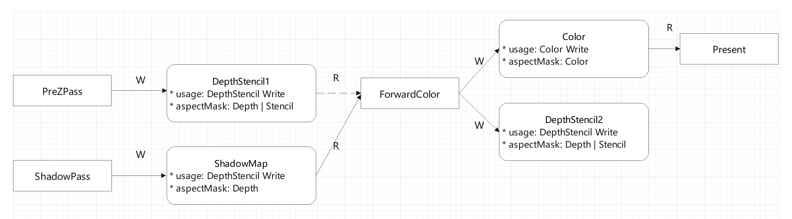

## FrameGraph Setup
FrameGraph 分为数据和Task两部分，数据部分包括资源(Image/Buffer)和配置，Task 包括GraphicPass, ComputePass等，在 FrameGraph 中统一将 Task 称为 Pass。  

常用 Pass 类型
| 类型            |  说明                                            |
| -------------- | ----------------------------------------------- |
| RasterPass     | 包含大量 DC 的 Pass，通常为 View + DratItemList 组合 |
| FullScreenPass | 仅包含一个全屏三角形的 Pass，通常为屏幕空间处理          |
| ComputePass    | 计算节点                                          |
| CopyPass       | 资源拷贝节点                                       |
| BlitPass       | Blit节点                                         |

### Memory 复用
首先讨论以下 Memory 复用会遇到的问题

### 资源配置
对于 FrameGraph 来说资源存在 Source 和 View 两种形式，Source 为数据源即 Image 或者 Buffer，View 作为 Pass 的 Attachment 存在，并与 Pass 共同作为 Graph 的节点。  
  
资源读 Attachment -> Pass 与 资源写 Pass -> Attachment 形成一条有向边，所有的 Pass 对资源的读写形成一个有向无环图。

存在几种情况，此处 Image 与 Buffer 同理
1. 对外部 Import Image 进行读写
2. Pass 新创建 Image\Attachment 写
3. 对前一个 Pass 的 Attachment 读
4. 对前一个 Pass 的 Attachment 写，产生一个重命名的 Attachment，并形成 Read - Write 关系

再考虑 Attachment，其作用包括：
* 作为 GraphicsPass 的 Color\Resolve\Input\DepthStencil Attachment，用于创建 FrameBuffer。
* 作为 Pass 的 Shader 输入 \ 输出，绑定到 DescriptorSet，Sampled Image\ Storage Image。
* 辅助自动生成 Pipeline Barrier
* 记录生命周期以实现内存复用

此外为了解决 Barrier 和 Memory 的问题，Attachment 还需要记录额外的信息。